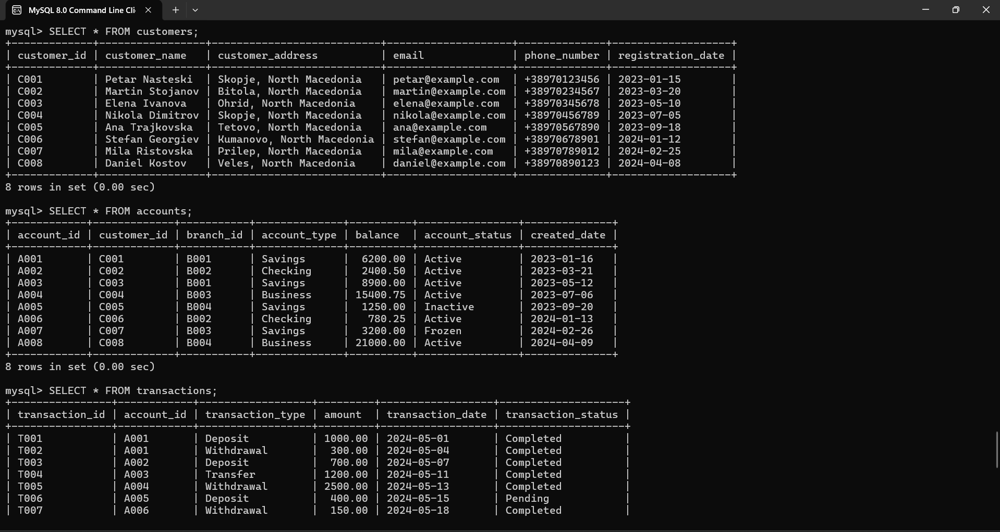
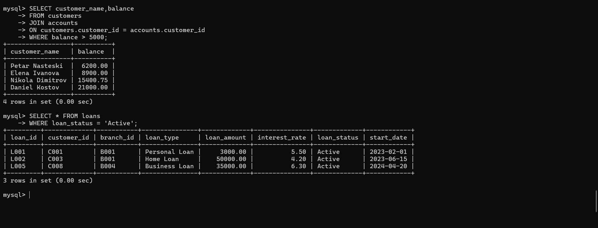
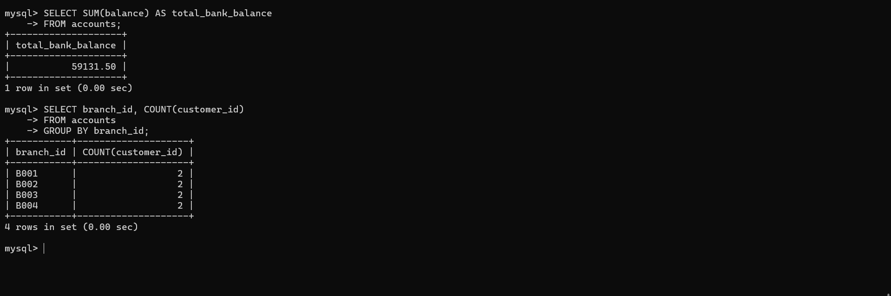

# BankFlow – Banking Management SQL Database

## Overview
BankFlow is a relational banking database system developed using MySQL.  
The project simulates core banking operations such as customer management, account handling, transactions, and loan tracking.

## Features
- Customer management
- Account management
- Transaction records
- Loan tracking
- Branch management
- SQL joins and relational queries

## Technologies Used
- MySQL
- SQL
- MySQL Workbench

## Database Concepts
This project demonstrates:
- Relational database design
- Primary and foreign keys
- SQL joins
- Aggregate functions
- GROUP BY and ORDER BY queries
- Data filtering and management

## Example Queries
```sql
SELECT customer_name, balance
FROM customers
JOIN accounts
ON customers.customer_id = accounts.customer_id
WHERE balance > 5000;

## Project Screenshots

### Customers Table


### Transactions and Accounts


### SQL JOIN and Loan Queries

